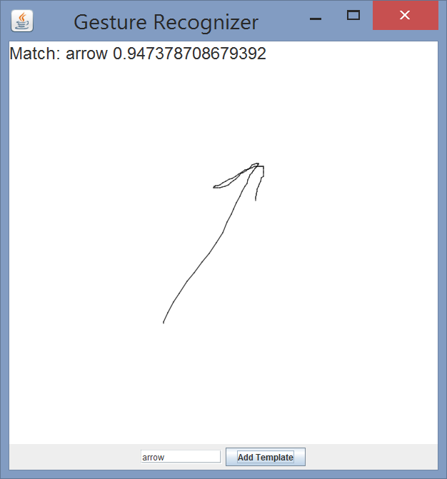
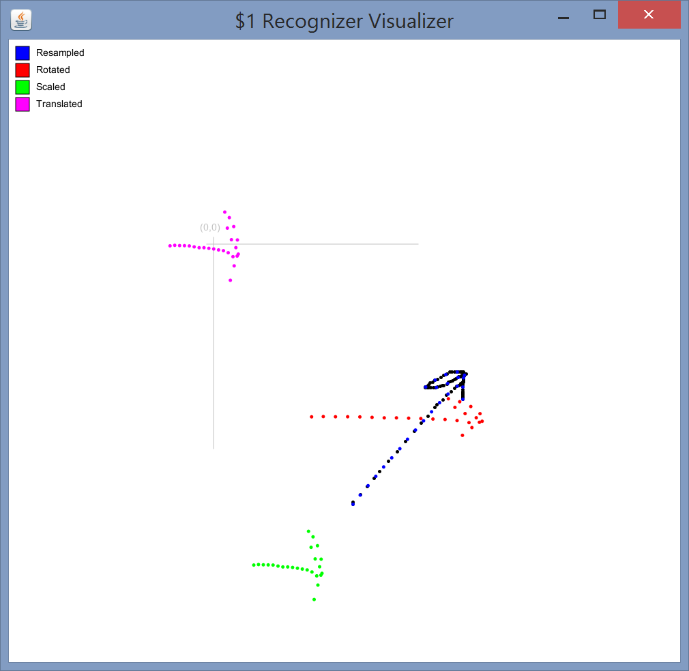
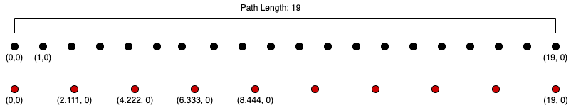

Comp 128 HW1: Gesture Recognizer
================================

For this homework assignment, you will practice using data structures to implement an algorithm for gesture recognition of drawn 2D gestures.

### Due Dates
This homework will have three milestones:

* Part 1: For this milestone, you should answer the Part 1 Questions below. Submit your answers on the Moodle assignment that corresponds with this homework.
* Part 2: For this milestone you should commit and push the code to allow a user to draw a gesture. The gesture does not need to be recognized at this point.
* Part 3: For this milestone you should commit and push the completed assignment that allows users to add templates and recognize gestures. The test files should pass.

### Part 1 Questions

The algorithm you will implement is called the $1 Gesture recognizer. Start by reading the [research paper](./res/1dollar.pdf) describing the algorithm which was published at the User Interface Software and Technology (UIST) Symposium in 2007.

For part 1, you should answer the following questions:

1. In the starter code, we have declared a double-ended queue (Deque) data structure to hold the list of drawn points. Describe why this is an appropriate choice.
2. In order to draw the gesture on the CanvasWindow, you will need to implement several mouse event handlers. List each of the methods you will use, and briefly describe what actions you will need to take in order to draw the gesture on the CanvasWindow. 
3. **In your own words**, describe each step of the recognition algorithm. For each step, explain why the actions performed on the data are needed.
4. Please review each of the provided classes that we have given you. For each one, describe their purpose. When might you want to use the functions provided?
5. We have given you a partial class decomposition. Can you think of any more classes you might need to store the data involved in this program? In particular think about what the return type of an attempted gesture recognition should be.
6. What is still confusing about the algorithm?

Please submit your answers in Moodle for the this homework assignment. Make sure that they are thoughtfully written. Please edit for grammar, clarity, and coherence.

### Part 2

For part 2, your code should allow the user to draw in the user interface shown in the image below. We have already given you the code that creates the user interface elements in `GestureWindow`.



The user should be able to click to clear any current drawings on the canvas and then drag with the mouse to draw a gesture (e.g. the arrow drawn in the upper portion of the screen). This will require implementing several mouse event handler methods. Hint: Look back at the Painter lab from comp127  and Listing 6.26 in the textbook for similar examples.
The gesture can be drawn in a CanvasWindow using Line objects from the [kilt-graphics package](https://mac-comp127.github.io/kilt-graphics/), formerly known as comp127graphics, between successive mouse points.

### Part 3

Complete the `Recognizer` class that implements the $1 gesture recognition algorithm. Re-read the portions of the paper describing the steps as needed, and refer to the hints below. I have provided a test class that you may use to test your implementation. Uncomment the code in `TestRecognizer` and complete the todo comments in the testRecognize method. Don't forget to write tests for any additional non-trivial methods that you add.

The `Visualizer` class allows graphical debugging. This class draws each step as a different color. You may need to enlarge the window to see all of the steps. Feel free to modify this class as needed to help you debug the code and make sure it is working. Visually examine the results and see if they make sense. This will work for the resample, rotation, scaling, and translating methods. A correct implementation, should produce the result below: 



Make the addTemplate method work. This should create a gesture template for the path parameter. Think carefully about which data structure you will use in your Recognizer class to store the gesture templates. It is okay to use ones discussed in comp127, even if we haven't gotten to them yet this semester. Practice class/Method decomposition!

Hook your recognizer up to the rest of your user interface. When the user presses the mouse, the previous drawing should be cleared from the canvas. On releasing the mouse, the gesture should be recognized, and the name of the closest match and the score should be displayed in a `matchlabel` label on the screen. See the GestureWindow screenshot above for an example.

### Helpful Hints

* When drawing the gesture, each time you move the mouse you need to store the 2D point representing its position at that point in time. We have provided a Point class that you can use. Hint: look carefully at the methods defined in the Point class. They will be useful when implementing the recognition algorithm.
* The Point class’s rotate method assumes that the angle is in radians, not degrees!
* A template consists of a name and some points. Making a new class to group these things together will help you write cleaner code.
* To make the visualizer show both a matching template _and_ its match score, you will probably need a new class, a “Match” or “Result,” that groups those two things together.

You will also find some pseudo-code for some of the steps below. Think carefully about the pseudo-code and cross reference it with the algorithm description in the paper. Don't just blindly copy it. As always, you should make sure you use good method decomposition.

#### Resampling Points


To resample the path into only n points (we use n=64):
1. Calculate the total path length of the original path by adding up the distances between successive points.
2. Divide this path length by (n–1), where n is the number of resampled points we want to achieve, to get the distance between each of the resampled points. We will call this the resampleInterval.
3. Add the first point to the list of resampled points.
4. Iterate over the original points in the path. Keep track of the current point and the previous point each iteration.
	1. As you iterate, calculate the current distance between the current and previous point.
    2. If that distance plus the accumulated distance so far is equal to or exceeds the resampleInterval, calculate where the resampled point should lie by linearly interpolating (see the Point.interpolate method) between the current iteration point and the previous. The alpha value for the interpolation should be (resampleInterval - accumulatedDistance)/segmentDistance, where accumulated distance is the total distance from the last output resampled point to the previous iteration point and segmentDistance is the distance between the current iteration point and the previous iteration point. Add the resampled point to the list of resampled points and set the previous iteration point to be the resampled point (We want the next segment distance to be from the resampled point to the current iteration point). Reset the accumulatedDistance to zero and continue iterating without resetting the current point.
    3. Otherwise, add the current distance to the accumulated distance. Update the previous and current point variables for the next iteration.
5. It is possible due to rounding errors that the last segment distance will be slightly less than the resampleInterval, leading to only n-1 resampled points. If that is the case, add the last original point to the resampled points list.


To help debug, you can add print statements to your resample method or set break points to step through your code. The resample test should provide the following steps when resampling from 20 points along the x-axis to 10 points:



```
Resample interval: 2.111111111111111
Adding first point (0.0, 0.0)
Previous point: (0.0,0.0) Current point: (1.0,0.0) segmentDistance=1.0 accumulatedDistance=1.0
Previous point: (1.0,0.0) Current point: (2.0,0.0) segmentDistance=1.0 accumulatedDistance=2.0
Previous point: (2.0,0.0) Current point: (3.0,0.0) segmentDistance=1.0 accumulatedDistance=3.0
	Adding resampled point: (2.111111111111111,0.0)
Previous point: (2.111111111111111,0.0) Current point: (3.0,0.0) segmentDistance=0.8888888888888888 accumulatedDistance=0.8888888888888888
Previous point: (3.0,0.0) Current point: (4.0,0.0) segmentDistance=1.0 accumulatedDistance=1.8888888888888888
Previous point: (4.0,0.0) Current point: (5.0,0.0) segmentDistance=1.0 accumulatedDistance=2.888888888888889
	Adding resampled point: (4.222222222222222,0.0)
Previous point: (4.222222222222222,0.0) Current point: (5.0,0.0) segmentDistance=0.7777777777777777 accumulatedDistance=0.7777777777777777
Previous point: (5.0,0.0) Current point: (6.0,0.0) segmentDistance=1.0 accumulatedDistance=1.7777777777777777
Previous point: (6.0,0.0) Current point: (7.0,0.0) segmentDistance=1.0 accumulatedDistance=2.7777777777777777
	Adding resampled point: (6.333333333333334,0.0)
Previous point: (6.333333333333334,0.0) Current point: (7.0,0.0) segmentDistance=0.6666666666666661 accumulatedDistance=0.6666666666666661
Previous point: (7.0,0.0) Current point: (8.0,0.0) segmentDistance=1.0 accumulatedDistance=1.666666666666666
Previous point: (8.0,0.0) Current point: (9.0,0.0) segmentDistance=1.0 accumulatedDistance=2.666666666666666
	Adding resampled point: (8.444444444444445,0.0)
Previous point: (8.444444444444445,0.0) Current point: (9.0,0.0) segmentDistance=0.5555555555555554 accumulatedDistance=0.5555555555555554
Previous point: (9.0,0.0) Current point: (10.0,0.0) segmentDistance=1.0 accumulatedDistance=1.5555555555555554
Previous point: (10.0,0.0) Current point: (11.0,0.0) segmentDistance=1.0 accumulatedDistance=2.5555555555555554
	Adding resampled point: (10.555555555555555,0.0)
Previous point: (10.555555555555555,0.0) Current point: (11.0,0.0) segmentDistance=0.44444444444444464 accumulatedDistance=0.44444444444444464
Previous point: (11.0,0.0) Current point: (12.0,0.0) segmentDistance=1.0 accumulatedDistance=1.4444444444444446
Previous point: (12.0,0.0) Current point: (13.0,0.0) segmentDistance=1.0 accumulatedDistance=2.4444444444444446
	Adding resampled point: (12.666666666666666,0.0)
Previous point: (12.666666666666666,0.0) Current point: (13.0,0.0) segmentDistance=0.3333333333333339 accumulatedDistance=0.3333333333333339
Previous point: (13.0,0.0) Current point: (14.0,0.0) segmentDistance=1.0 accumulatedDistance=1.333333333333334
Previous point: (14.0,0.0) Current point: (15.0,0.0) segmentDistance=1.0 accumulatedDistance=2.333333333333334
	Adding resampled point: (14.777777777777777,0.0)
Previous point: (14.777777777777777,0.0) Current point: (15.0,0.0) segmentDistance=0.2222222222222232 accumulatedDistance=0.2222222222222232
Previous point: (15.0,0.0) Current point: (16.0,0.0) segmentDistance=1.0 accumulatedDistance=1.2222222222222232
Previous point: (16.0,0.0) Current point: (17.0,0.0) segmentDistance=1.0 accumulatedDistance=2.222222222222223
	Adding resampled point: (16.88888888888889,0.0)
Previous point: (16.88888888888889,0.0) Current point: (17.0,0.0) segmentDistance=0.11111111111111072 accumulatedDistance=0.11111111111111072
Previous point: (17.0,0.0) Current point: (18.0,0.0) segmentDistance=1.0 accumulatedDistance=1.1111111111111107
Previous point: (18.0,0.0) Current point: (19.0,0.0) segmentDistance=1.0 accumulatedDistance=2.1111111111111107
Adding last point: (19.0,0.0)
```

#### Rotate to Zero

1. Calculate the indicative angle by finding the centroid of the points, i.e the average of the x and y values of the points, and subtracting the first point in the gesture. The angle this makes with the x-axis is the indicative angle.
2. Rotate each point in the gesture around the centroid by the **negative** indicative angle to align the gesture with the x-axis.
3. You can confirm that rotation is correct by running the visualizer. Visually confirm that the red rotated arrow points along the x-axis.

#### Scale to Square

1. Calculate bounding size (width and height) of the gesture. The width is the maximum x value for any point in the gesture minus the minimum x value. The height is the maximum y value minus the minimum y value.
2. Scale each point in the gesture by (size / width, size / height), so that the resulting bounding box will be a square with width and height equal to size. We use size=250, but you should make this a named constant so its easy to change later.
3. Visually confirm in the Visualizer that the green scaled arrow is distorted into a square shape.

#### Translate to point

1. Calculate the centroid of the points.
2. Translate to a point k, by adding k to each point in the gesture and subtracting the centroid.
3. Visually confirm in the visualizer that the pink arrow's centroid is centered on the origin, k = (0,0).

#### Recognition

The path-distance between a gesture (G) and a template gesture (T) is the mean of the distances between the points at each index, i.e. the distance between G_0 and T_0, plus the distance from G_1 to T_1, etc divided by n. This is described in equation 1 in the paper.
The `distanceAtBestAngle` method performs the golden section search for the rotation angle that minimizes the distance between a gesture and a template. It returns the path-distance at this angle. If you are curious how this works, here is a good [video explanation](https://www.youtube.com/watch?v=VBFuqglVW3c).

To recognize a gesture, iterate over the possible templates. For each template, calculate the distanceAtBestAngle between the gesture and the candidate template. Keep track of the minimum distance found and the corresponding template. Return the matching template and score calculated using equation 2 in the paper.

### Appropriate Resources

In this assignment, the primary learning goals are to gain practice using data structures, develop good object-oriented organizational habits, and to learn how to convert pseudo-code into valid java. As a published research algorithm, there are many code solutions that exist for the $1 gesture recognizer. Looking at these or any other student's code would negate the benefits you will gain by completing the assignment and is a violation of Macalester's academic integrity policy. You may discuss the assignment with other students, but do not share your code or look at other code. **The only resources you may use to help you on the assignment are the research paper and pseudo-code described above.**  Misuse of resources will result in a zero grade and further action per Macalester's policy on Academic Integrity. If you get stuck, I would encourage you to visit the preceptor's or my office hours to get help.

### Submission

Part 1 will be submitted on moodle. It will be graded based on effort shown in answering the four questions.
 
The code for parts 2 and 3 should be committed and pushed to github.

Please make sure to follow the guidelines for [good java style](https://docs.google.com/document/d/1GT207Pia0q7bETKrqSi--C3X7N_67XgRXYEvQFrwHdI/edit?usp=sharing). I have given you tests for most of the methods described in the pseudo-code, but you should add additional tests for any non-trivial methods you add.

To receive full credit, you must have:
* Good class decomposition
* Good method decomposition
* Correct Execution:
  * The user should be able to draw a gesture by clicking and dragging with the mouse
  * The user should be able to add a gesture that was just drawn as a template
  * After drawing a gesture, it should be recognized and the name and score should be displayed
* Correct Style
